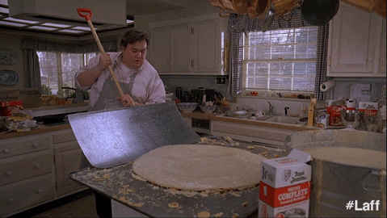

# Marmiwild, épisode 3


Formulaire d'ajout, URLs propres... tu as déjà parcouru beaucoup de chemin depuis la première version de Marmiwild.  
Plusieurs fonctionnalités manquent encore, notamment modifier/supprimer une recette.  
Et je suis sûr que tu as déjà plein d'idées pour donner du style au site (si ce n'est pas déjà fait 🤓).  
Mais attends un peu jeune padawan, laisse moi d'abord te parler de la POO.


{: .text-center }

## POO ?

Tu as peut-être déjà entendu ces 3 lettres sortir de la bouche de ton formateur ou de ta formatrice, telle une invocation secrète de quelque magie encore obscure.
Comme tout ce que tu as déjà vu pendant ta formation, il n'y a rien de bien méchant même si cela un peu paraitre déroutant au démarrage.

La POO, pour **P**rogrammation **O**rientée **O**bjet, est une manière d'organiser le code basée sur l'idée d'*"objets"* plutôt que sur l'idée de *"procédure"*.  
Les instructions sont toujours regroupées dans des fonctions. Seulement, les fonctions qui agissent sur les mêmes informations sont elles-même regroupées dans des grandes boîtes, comme des familles ou des catégories : c'est ce qu'on appelle des *"classes"*.  
Pour marquer le fait qu'une fonction appartient à une *"classe"*, on dira que c'est une *"méthode"*. Quand différentes méthodes manipulent les mêmes données, communes à l'ensemble de la *"classe"* qui les contient, on va parler de *"propriétés"*.
Même si tous ces termes ne sont pas encore clairs, tu peux déjà les voir illustrés dans [cette vidéo d'introduction à la POO](https://www.youtube.com/watch?v=pTB0EiLXUC8).  

Assez de *blabla* maintenant, voyons ça avec du code.

Clone ce dépôt grâce au lien donné au début de cette page ⬆ à&nbsp;la&nbsp;section&nbsp;<a href="#input-clone"><i class="bi bi-code-slash"></i>&nbsp;Code</a>.  
(pense à recréer un fichier *config.php* avec tes données de connexion)
{: .alert-info } 

## Objectifs

* Passer d'un code procédural à un code objet
* Te familiariser avec **CRUD** et **BREAD** (rien à voir avec 🥖)

## 1. Nouveau look pour un nouveau modèle

Pour créer ta première classe et mettre un peu de concret dans ce monde de flou, crée un nouveau repertoire `src/models/` avec un nouveau fichier nommé `RecipeModel.php` comportant ce code :

```php
class RecipeModel
{
}
```

Parlons d'abord de la ligne `class RecipeModel` : tu t'en doutes, le mot-clé `class` permet de déclarer une classe, tout comme le mot-clé `function` permet de déclarer une fonction.  
`RecipeModel` est le nom de ta classe. Tu noteras l'utilisation du PascalCase : la première lettre de chaque mot (y compris le premier) est une majuscule.
C'est la [convention en PHP pour les noms de classe](https://www.php-fig.org/psr/psr-1/).

Pour l'instant, la classe est vide. Tu peux la compléter pour que ton fichier ressemble au code suivant :

```php

class RecipeModel
{
    private $connection;

    public function __construct()
    {
        $this->connection = new \PDO("mysql:host=" . SERVER . ";dbname=" . DATABASE . ";charset=utf8", USER, PASSWORD);
    }

    public function getAll(): array
    {
        $statement = $this->connection->query('SELECT id, title FROM recipe');
        $recipes = $statement->fetchAll(PDO::FETCH_ASSOC);

        return $recipes;
    }
}
```
 
Dans la classe, tu as d'abord déclaré la méthode `getAll` qui reprend les instructions de la fonction `getAllRecipes` du fichier `src/models/recipe-model.php`.  
Toutes sauf une : l'initialisation de la connexion à la base de données.
Dans `getAllRecipes`, tu devais appeler explicitement une fonction `createConnection` qui te retournait une connexion (sous la forme d'un objet PDO).
Si tu regardes le code de ta classe, cette création existe maintenant dans la fonction `__construct`. Elle initialise une variable qui est déclarée juste au dessus, en dehors de la fonction.  

Je te vois bondir :

> "Mais en PHP, **dans** une fonction on ne peut pas accéder à une variable déclarée **en dehors** de la fonction ?!?"

Tu as raison. Sauf si la variable est déclarée dans la même classe que la fonction : la propriété et la méthode font partie du même objet.  
C'est aussi là que le mot-clé `this` intervient : pour préciser dans `__construct` que tu veux accéder à la propriété `$connection` de la classe.  
C'est le sens de `$this->connection` : la propriété `connection` déclarée dans *cette* classe.  
C'est cette même propriété que tu retrouves avec le `$this->connection` de la méthode `getAll`.  
Pour que cela fonctionne, à un moment quelqu'un devra donc d'abord appeler `__construct` pour initialiser `$this->connection`, puis `getAll` pour l'utiliser.  
Tu vas faire ça dans `src/controllers/recipe-controller.php`. Modifie `browseRecipes` pour qu'il ressemble à ce code : 

```php
<?php
// Ton ancienne gestion du modèle, bientôt obsolète
require __DIR__ . '/../models/recipe-model.php';
// Ta nouvelle gestion du modèle de ton application, qui va bientôt totalement remplacer la précédente.
require __DIR__ . '/../models/RecipeModel.php';


function browseRecipes(): void
{
    // Fetching all recipes
    $model = new RecipeModel();
    $recipes = $model->getAll();

    // Generate the web page
    require __DIR__ . '/../views/indexRecipe.php';
}
```

N'oublie pas d'ajouter le `require` au début du contrôleur pour bien avoir accès au code qu'il contient.  
Tu appelles bien ici la méthode `getAll`, mais pas `__construct`. Enfin, pas de façon évidente.  
La méthode `__construct` est appelée automatiquement quand tu utilises le mot-clé `new` avec le nom d'une classe.  
Tu es en fait en train de construire un nouvel objet à partir du code de ta classe.  
Tous les éléments sont donc là, même s'ils ne sont pas tous visibles dans le code : l'appel de `__construct` et l'appel de `getAll`.  
Tu peux vérifier que la page d'accueil fonctionne toujours.  
Essaie d'ajouter une méthode `getById` dans `RecipeModel` en t'inspirant de `getRecipeById` dans `recipe-model.php`.  
Utilise ensuite cette méthode dans l'action `showRecipe` du fichier `recipe-controller.php`. Pense bien au passage du paramètre `$id`.  
Laisse de côté la fonction de création de recette pour l'instant. Tu t'en occuperas plus tard.  

## 2. Au tour du contrôleur

Si tu regardes le fichier `src/controllers/recipe-controller.php`, tu devrais maintenant remarquer ces 2 blocs de code :

```php

// ... 

// Fetching all recipes
$model = new RecipeModel();
$recipes = $model->getAll();

// ... some code ...

// Fetching a recipe
$model = new RecipeModel();
$recipe = $model->getById($id);

// ... 

```

Tu te doutes maintenant de ce qui va arriver : une répétition de code avec `$model = new RecipeModel()`, un même comportement utilisé sur un même "objet" avec des appels de méthode sur `$model`...
Tu as là tous les symptômes d'un besoin d'optimisation de code, et dans ce cas, la création d'une classe !
Crée un fichier `src/controllers/RecipeController.php` qui contient ce code :

``` php
<?php 

require __DIR__ . '/../models/RecipeModel.php';


class RecipeController
{
    private $model;

    public function __construct()
    {
        $this->model = new RecipeModel();
    }

    public function browse(): void
    {
        $recipes = $this->model->getAll();

        require __DIR__ . '/../views/indexRecipe.php';
    }
}
```

Tu retrouves ici le code de la procédure `browseRecipes`, adapté dans une méthode `browse` d'une classe `RecipeController` (en PascalCase).  
À ceci près que la variable `$model` est initialisée dans le constructeur.  
C'est le même principe que la connexion à la base de données dans la classe `RecipeModel` : initialisée une fois, pour être tout de suite disponible dans toutes les méthodes.  
Tu peux maintenant transformer le fichier `src/routing.php` pour qu'il utilise ta nouvelle classe lors de l'affichage de la page d'accueil ainsi :

```php

// Ton ancienne gestion du controller, bientôt obsolète
require __DIR__ . '/controllers/recipe-controller.php';
// Ta nouvelle gestion du controller de ton application, qui va bientôt supplanter la précédente.
require __DIR__ . '/controllers/RecipeController.php';

$urlPath = parse_url($_SERVER['REQUEST_URI'], PHP_URL_PATH);

if ('/' === $urlPath) {
    $recipeController = new RecipeController();
    $recipeController->browse();
} else { // ...
```

>⚠️ Si tu recharges la page,  peut-être as-tu ce message d'erreur :  
```
>Fatal error: Cannot declare class RecipeModel, because the name is already in use in /home/{wilder}/{path-to-workshop}/php-advanced-1-material/src/models/RecipeModel.php on line 3.
```

C'est tout à fait normal. Si tu ouvres et observes les fichiers `/controllers/recipe-controller.php` et `/controllers/RecipeController.php`, tu verras que tous deux appellent le même fichier `/../models/RecipeModel.php`. PHP considère alors que tu déclare DEUX classes différentes avec le même nom, et ça, il ne le tolère pas. Dans ce cas, tu as 2 options :
- retirer la ligne `require __DIR__ . '/controllers/recipe-controller.php';` de ton fichier `routing.php`, car tu n'en auras bientôt plus besoin,
- utiliser `require_once` au lieu de `require` lors de tes inclusions de fichiers.

Constate que la page d'accueil fonctionne à nouveau avec cette nouvelle architecture.
Complète `RecipeModel` et `RecipeController` pour te débarrasser définitivement de `recipe-model.php` et `recipe-controller.php`. Ils ont fait leur temps 👋.

**Astuce :** pour la partie ajout, ta fonction de validation peut elle-même devenir une méthode.


## 3. Des miettes de pain

Tu as mis en place des actions pour :

* lister les recettes,
* afficher une recette en particulier,
* ajouter une recette.

Ce sont 3 fonctionnalités classiques quand tu gères des ressources (ici des recettes de cuisine).
Chaque fois que tu auras à gérer une ressource dans un projet, tu auras probablement à mettre en place ces actions.
Pour t'en rappeler, et savoir quelles sont les autres actions classiques, tu peux retenir l'acronyme **BREAD** (non, toujours pas 🥖) :

* **B**rowse pour lister les ressources : cette action correspond typiquement à un
```sql
SELECT * FROM table
```
* **R**ead pour afficher **une** ressource : cette action correspond typiquement à un
```sql
SELECT * FROM table WHERE id=?
```
* **E**dit pour modifier une ressource : cette action correspond typiquement à un
```sql
UPDATE table SET ... WHERE id=?
```
* **A**dd pour ajouter une ressource : cette action correspond typiquement à un
```sql
INSERT INTO table ...
```
* **D**elete pour supprimer une ressource : cette action correspond typiquement à un 
```sql
DELETE FROM table WHERE id=?
```

Ces 5 actions reprennent les principales opérations que tu peux faire dans une base de données, le fameux **CRUD** :

* **C**reate pour l'instruction `INSERT INTO`,
* **R**ead pour les instructions `SELECT` (avec et sans clause `WHERE id=?`),
* **U**pdate pour l'instruction `UPDATE`,
* **D**elete pour l'instruction `DELETE`.

Voici ta mission : finis ton "pain" (*bread* en anglais) en ajoutant les actions Edit et Delete.
Arme-toi de courage, de patience et de l'aide des formateurs, formatrices et des autres Wilders 💪🧠


{: .text-center }